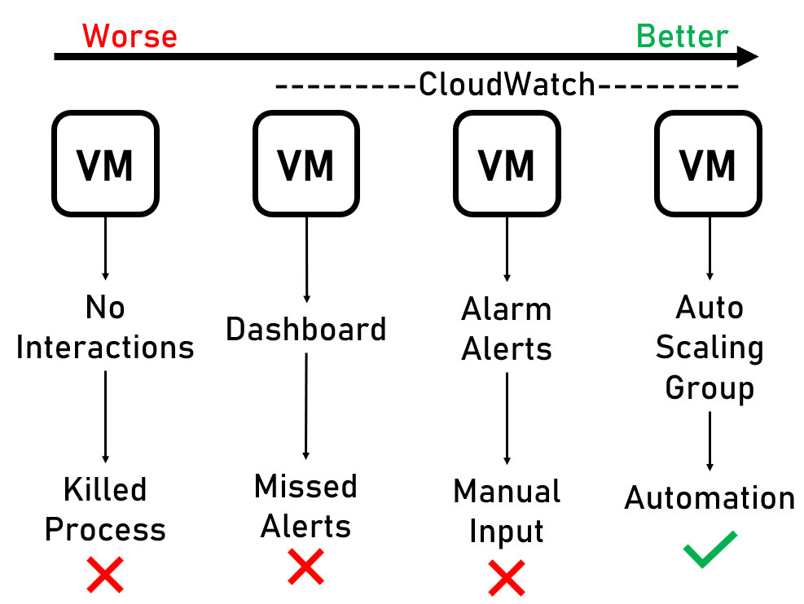

# Amazon AWS - Cloudwatch

There are four main stages in alert and alarm management, here I will explain each stage from Worse to Best.

-------------

### Stage 1 - No Interactions
This stage is the simplest of stages, where no alert or alarm management is in place, all you have is your virtual machine running. This is the worst case scenario as you have zero measures in place. This meaning that your virtual machine can easily overload and lose performance without you knowing.

---------------------------------
### Stage 2 - Dashboard
When creating Virtual Machines on Amazon AWS, you can add a dashboard which will provide data on different metrics on the Virtual Machine, including CPU ultilisation, this is the next stage as it provides the most basic alert management system. You can easily set up a dashboard here: [Dashboard Set-up](dashboard/creating_dashboard.md). However, with this set-up it is fully maunal and provides no automation, meaning you would have to have someone constantly monitoring the dashboard to avoid missing alerts which can become expensive and complicated with more complex systems.

-----------------------------

### Stage 3 - Alarm Alerts
Stage 3 is where alarms come into place, within Amazon cloudwatch you are able to set up an alarm such that you will get notified when your Virtual Machine reaches a specified threshold. (Example: >50% CPU usage). You can set up an alarm with the guild: [Alarm Set-up](alarm/creating_alarm.md). With this stage you no longer have to constantly monitor the activity of the virtual machine and act when the threshold is complete. However, this still has it downsides, it requires you to be available 24/7 to make changes if required, if the system alarm goes off and you are asleep, that isn't the best. This leads into stage 4.

----------------------

### Stage 4 - Auto Scaling Group (ASG)
Stage 4 completes the automation process and provides the best alert and alarm management system. Stage 3 provides the automatic alert and alarm but the auto-scaling group provides the automatic response, you can set up a ASG to respond to alarms and alerts such that more VM are built when CPU usage is high. This avoids any disaster caused from high traffic and requires no manual input

-----------
