# How to create a cpu usage alarm

1. Go to CloudWatch console
2. In the navigation pane, select **Alarms**, then **All Alarms**  
   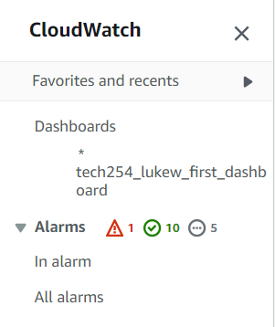
3. Choose **Create Alarm**  
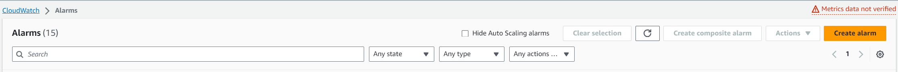
4. Choose **Select metric**  
   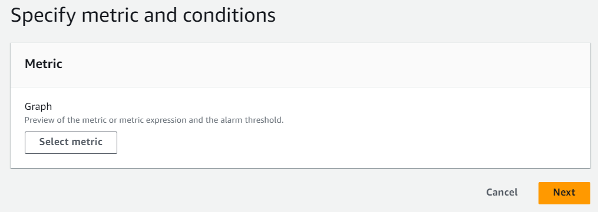
5. In the **All metrics**
   1. Select the **EC2** tab  
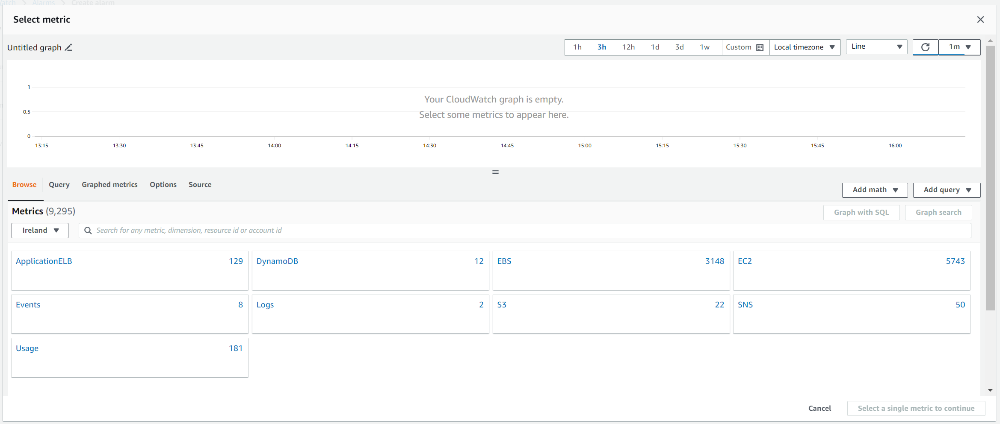
   2. Select **Per-Instance Metrics**  
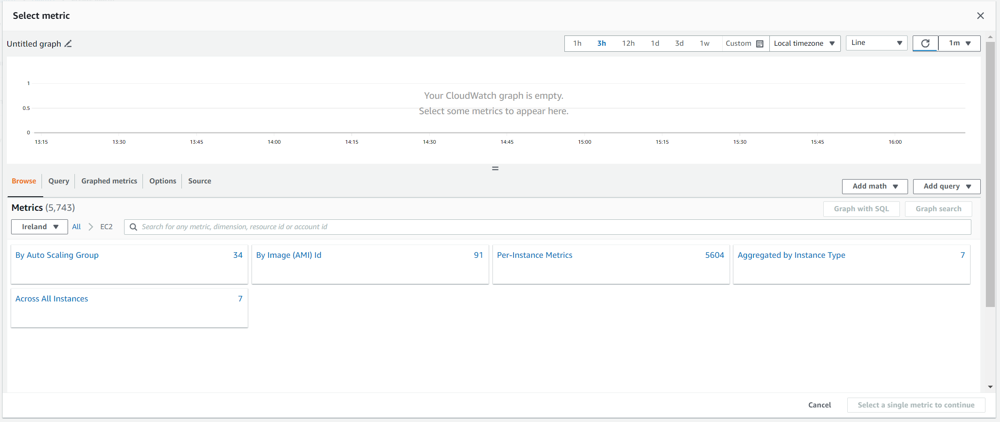
   3. In the search bar paste in the id of your instance
   4. Scroll to find the metric named **CPUUtilization**  
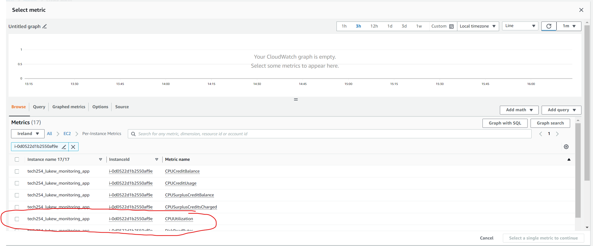
   5. Select Metric
6. In Specify metric and conditions
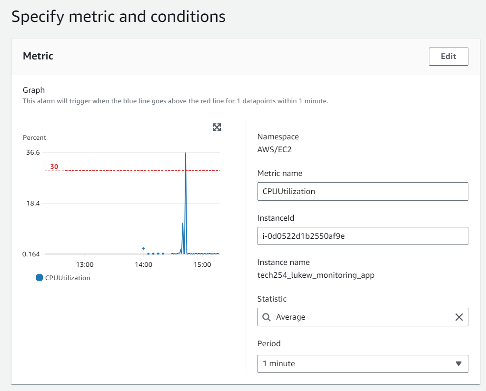
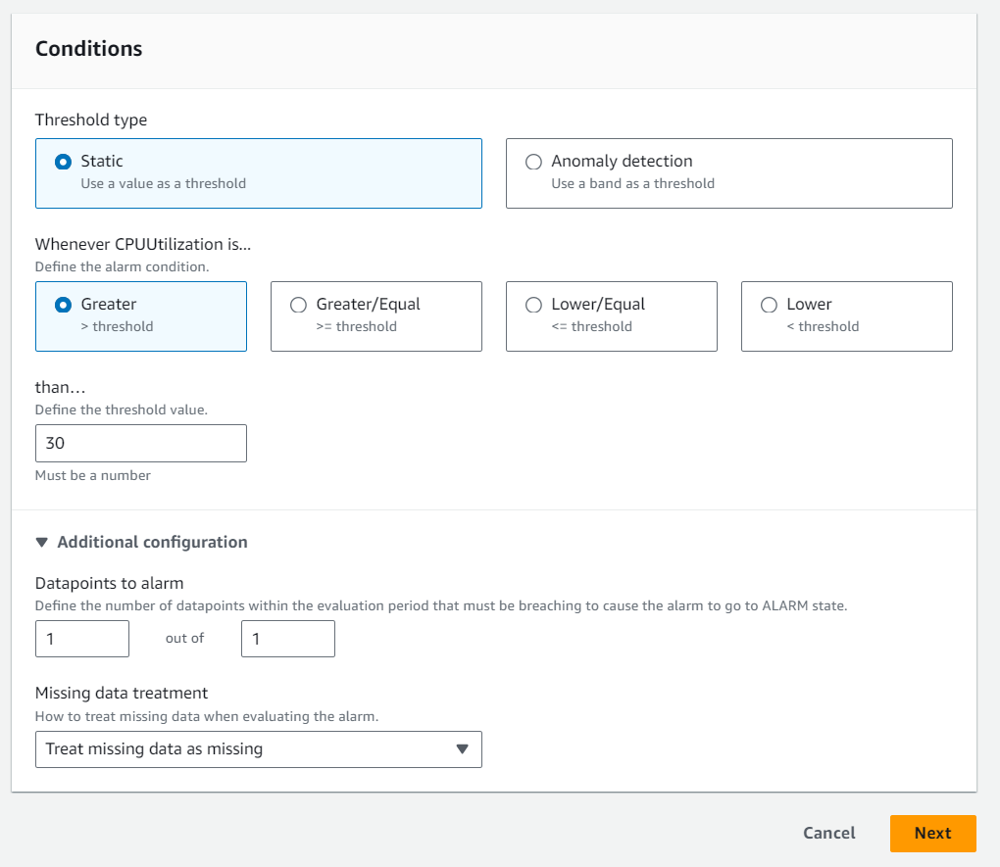
   1. **Metric** - **Statistic** check that it is set to average.
   2. **Conditions** - **Threshold type** keep that as static
   3. Select the threshold you require for your alarm, the number value as well as the condition.
   4. Select **Next**
7. Notifications
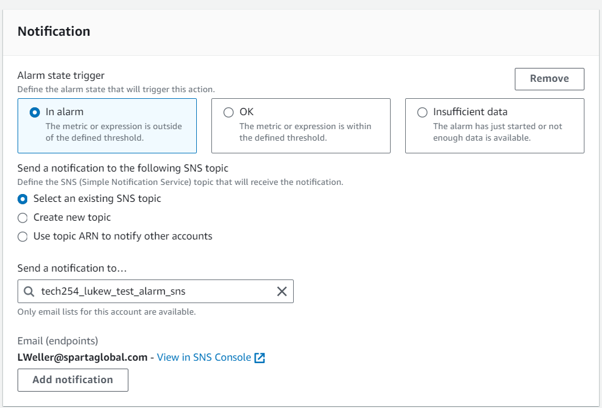
   1. Select **In Alarm**
   2. **Create new topic**
   3. Enter topic name
   4. Enter email to notify
   5. Next
8. Name and Description
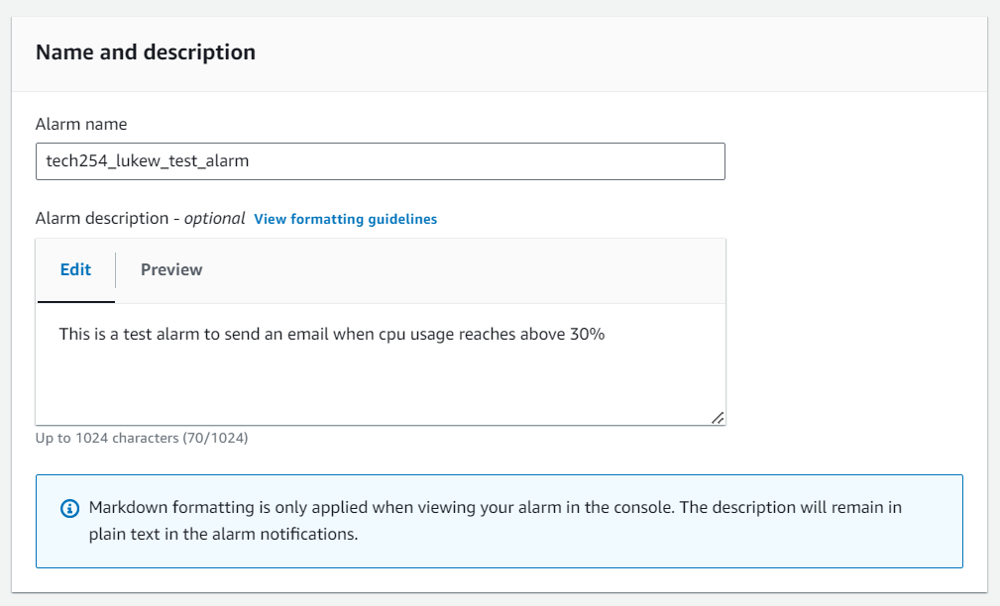
   1. Enter the name of your alarm
   2. Enter a description explaining what the alarm is for
9. Confirm subscription for the alarm SNS topic by going to your email you should find an email that looks the same as below.
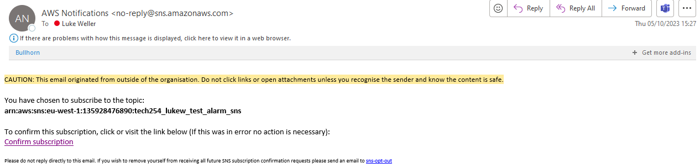
10. Receiving alarms once the threshold is met, you will recieve another email that will look like:
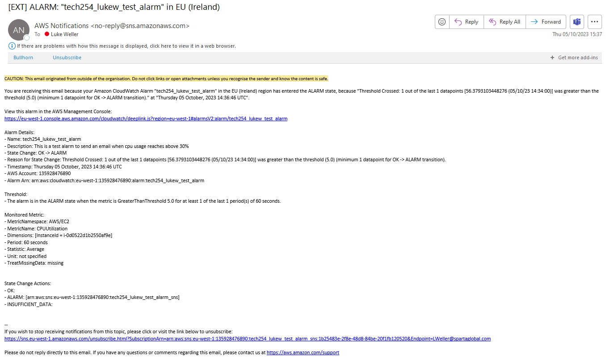

