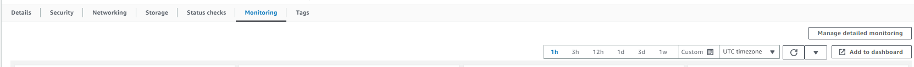
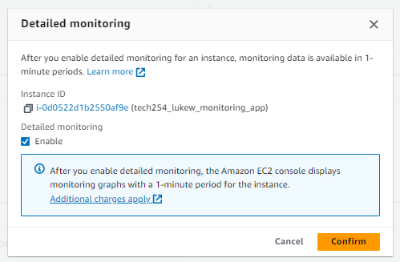
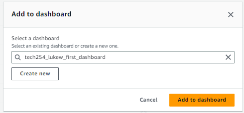

# How to create a dashboard to monitor instance usage.
1. Create an instance
2. Go to Instance summary
3. Scroll down and click on monitoring in the tabs

4. On the right side will be an option for Manage detail monitoring
   1. This allows you to enable detail monitoring which will check the instance in periods of a minute (does cost more)  

   2. Under Detailed monitoring check the "Enable" box
   3. Confirm
5. Below Detailed monitoring select Add to dashboard
   1. You will be moved to CloudWatch were you can create or use existing dashboard

   2. Either create new with the name or select an existing dashboard from the dropdown menu.
   3. Add to Dashboard

