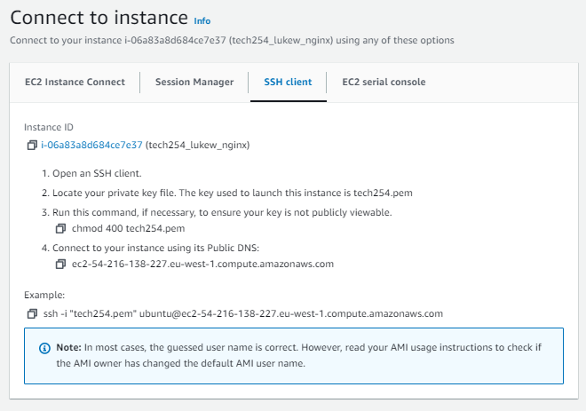

# App Deployment in EC2

### Starting an instance
- To Start you want to go into AWS service called EC2 and Start and instance by clicking the orange button "Launch Instance". For the setup of the instance follow the steps below, anything not mentioned directly is left as default.
- First step in creating an Instance is to go to the AWS webpage and on services select EC2.
- In here you want to click on the orange button named "Launch Instance".
### Setting up an Instance
For the instance, what you'd want to do is to go through each section and fill it out. Any part that isn't mentioned here is to be left as default.
- **Name and tags**
  - The name and tags is to distinct your instance from others so having a clear and consistent naming system is important, for most cases I will use "tech254_lukew" followed by the use of the instance, in this case "nginx" as I am creating a nginx webserver.
  - **tech254_lukew_nginx**
  -  This should look like:

- **Application and OS Images**
  - The Amazon Machine Image is apart od the Application and OS Images, these contain base templates for software configuration that is required for the virtual machines. To access the AMI for nginx follow the step by step process below:
  - **Browse more AMIs** 
    - On the page, click on the link to browse more AMIs, this should be found on the right hand side with a magnifying glass
  - **Community AMIs** 
    - Along the tabs, go to community AMIs, this is where AMIs created by the community are posted, be careful with these as they aren't always verified by AWS.
  - **18.04 LTS 1e9** 
    - In the search bar enter "18.04 LTS 1e9" and there should be two options that appear, for this we want the Ubuntu version 18.04
  - **ami-0a7493ba2bc35c1e9** 
    - This is the AMI id, use this to check you have the correct AMI
  - Click **select** on the Ubuntu AMI, this will take you back to the launch instance page showing:

- **Instance Type** 
  - Instance types comprise varying combinations of CPU, memory, storage, and networking capacity and give you the flexibility to choose the appropriate mix of resources for your applications.
  - **t2.micro** 
    - Select the t2.micro instance type as this provides Free tier eligibility.

- **Key pair** 
  - Key pair is used to securely connect you to your instance, for this it is a ssh key which is called tech254.
  - **tech254** 
    - This key is a .pem file. Privacy Enhanced Mail (PEM) files are concatenated certificate containers frequently used in certificate installations when multiple certificates that form a complete chain are being imported as a single file
    
- **Network Settings**
  - **Security group name** 
    - Set a unique name for this, including your previous format (tech254_lukew) with the use of the security group
    - **tech254_lukew_basesg**
  - **Description** 
    - For now keep the same as the name, but when the security is more complex, a more detail description might be required
  - **Inbound Security Group Rules**
    - **port range** 
      - These are fixed for different source types
        - ssh - 22
        - HTTP - 80
        - HTTPS - 443
        - Custom CTP - anything not listed
    - **Source type** 
      - The source type is to select who can view your instance,
      - **Anywhere** 
        - Anyone with the ip can view the instance

  - Adding additional security groups, this is necessary as we want, HTTP, HTTPs, and port 3000
  - **Add security group rule** 
    - Repeat this as before but for each different group
    - **Type**
    - **Source Type**

  - **Configure Storage**
    - **Default**

  - **Advance Details**
    - **Default**

  - **Summary** 
    - Check your summary to ensure you have all the correct details  

  - **Launch instance**
### Running Instance
- **Instance Summary** - Once your instance has launched you can view its summary view clicking on the Instance ID (i-06a83a8d684ce7e37)

- **On AWS click connect**
- **SSH client**
- **Copy the Example, ensure that the user (ubuntu) is correct**


### Running Git Bash
For this stage you need to run git bash as an administrator so that you can access your instance
- **Run GitBash** (Need to log onto each git bash you want to use instance)
- Make your .pem file read only for you.
  - The reason you do this is to make sure no one other than you has access to your .pem file
  - `cd .ssh` Entering your ssh file
  - `chmod 400 tech254.pem` Makes the file read only, can't write in it, only need to do this once, if already done can skip

You want to copy across your app folder to your instance, this an either be done via the scp method or the git clone. For SCP follow these step, but for Git clone, skip this next step and go to **Update Virtual Desktop**

### SCP Method
- Copying over the app folder using scp (secure copy). You will need the file paths to both your .pem file and to your app folder. For the Ubuntu paste in the lin that you copied from running the instance.
```
scp -i "<filepath to .pem file>" -r <filepath to your local app folder> Ubuntu@<public IP>:<remote filepath>
```
- From the run instance, run the full ssh command.
```
ssh -i "tech254.pem" ubuntu@ec2-54-216-138-227.eu-west-1.compute.amazonaws.com
```
- Key notes:
  - (new ip each time you run after stopping)
  - ssh (use ssh)
  - -i (identity)
  - "tech254.pem" (ssh key pair)
  - ubuntu@ec2-54-216-138-227.eu-west-1.compute.amazonaws.com (where we want to go, ubuntu refers to the user your logging in as)
- output:

- Type yes to confirm


### Update virtual desktop
- Update to finds all available updates but doesn't implement them, this will also confirms internet connection.
```
sudo apt update
``` 
- Upgrade takes all the latest updates and implements the ones that need an update, `-y` to confirm
```
sudo apt upgrade -y
```

### Installing and Starting ngix
- Installs nginx
``` 
sudo apt install nginx -y
```
- Starts the nginx  
```
sudo systemctl restart nginx
``` 
- Enable nginx
```
sudo systemctl enable nginx
```
- Checks the status to see if it's running
```
sudo systemctl status nginx
``` 
 

### Git clone method
If you have completed the SCP method, skip this section and go to **Installing Nodejs**

- Create a GitHub repository containing the app folder. In your local system, create a local repo and push it to GitHub
```
git init
git add .
git commit -m "App folder"
git remote add origin [SSH connection to GitHub]
git push -u origin main
```
- On GitHub check that the folder has been push correctly and save the url link to it.
- Back into the terminal on your virtual desktop, install git
```
sudo apt install git -y
```
- Copy over the folder from GitHub using the url you saved.
```
git clone https://github.com/LukeWeller7/testing_scp_gitclone.git
```

### Installing Nodejs
- Curl, this command finds the specific version of nodejs, otherwise when you still it, it will try and install the latest version
```
curl -sL https://deb.nodesource.com/setup_12.x | sudo -E bash -
```
- Install nodejs
```
sudo apt install nodejs -y
```
- Check the version you are on
```
node -v
```
- Install pm2 via nodejs
```
sudo npm install pm2 -g
```
- keynotes:
  - npm - node packet manager (nodes version of pip)  
  - pm2 - process manager, manager for node processes, easier to manage the processors used by nodejs  
  - https://www.vultr.com/docs/how-to-manage-node-applications-with-pm2/

# Running the app
- Enter the app folder with `cd`, check with `ls` that the folder content is there.node
```
cd testing_scp_gitclone

cd app
```
- Install npm
```
npm install 
```
- Run the app
```
node app.js
```

In AWS you need to add port range 3000 to inbound security group
- go back to AWS and find your ip address in your instance summary  

- Paste into the url with the port :3000


