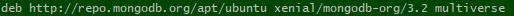
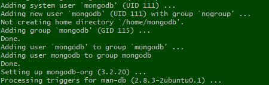
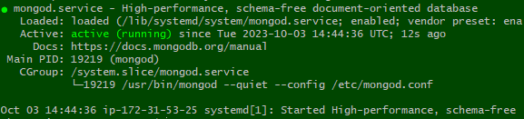
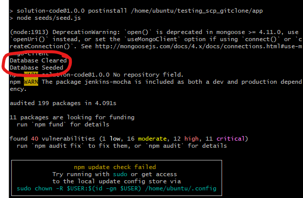

## Setup
- Create 2 AMI
- 1st AMI is for the app 
- 2nd AMI is for the mongodb
### App instance
- Launch instance based from the AMI  created for launching the app.
- Ensure that instance works  
### Database Instance
- launch a new instance for database
- **tech254_lukew_db**  
- create a blank 18.04 LTS 1e9 instance
- create a new security group
  - **tech254_lukew_db_sg**  
  - dont need http, https, 3000 as no web connection is needed, the only connection is through mongol_db  
  - add ssh, mongol_db
  - custom TCP (port:27017)  
- Open a new separate git bash
- Launch instance for db  
- in terminal, right click, selection options, in look, background, change background colour to help differentiate vms


## Creating the DB:
### In the DB instance
```
sudo apt update
sudo apt upgrade -y
```
This is to bring the instance up to date on all available updates.
```
wget -qO - https://www.mongodb.org/static/pgp/server-3.2.asc | sudo apt-key add -

```
Output:  
   
This command gets the key for version 3.2 of mongodb
```
echo "deb http://repo.mongodb.org/apt/ubuntu xenial/mongodb-org/3.2 multiverse" | sudo tee /etc/apt/sources.list.d/mongodb-org-3.2.list
```
Output:  
  
This command verifies the key
```
sudo apt update
```
This command find the updates for mongodb 3.2
```
sudo apt-get install -y mongodb-org=3.2.20 mongodb-org-server=3.2.20 mongodb-org-shell=3.2.20 mongodb-org-mongos=3.2.20 mongodb-org-tools=3.2.20
```
After installing you should expect the last few lines to look like: 
  
This command installs mongodb
```
sudo nano /etc/mongod.conf
```
This command takes you to the conf page  
In network interfaces, change the bindIp to 0.0.0.0 to allow all users to access mongodb
```
sudo systemctl start mongod
sudo systemctl enable mongod
sudo systemctl status mongod
```
Output:   
  
These commands start up mongod and check that it is active and running


## Connect the app to the db:
### In the App instance
Back on the app instance, create an environment variables
```
export DB_HOST=mongodb://<app public ID>:27017/posts
```
This command is setting an environment variable for the host ip of the mongodb so that anywhere within the instance with variable name can access the ip
```
npm install

Within Output: Database Cleared
               Database Seeded
```
Output:  
  
This command installs npm
```
node app.js
```
This command will run the app on nginx.


### Accessing the db on app website
- Find the public ip address for the app on AWS  
- Paste into search bar with port 3000/posts

