1. Start on AWS, go into EC2, on the navigation bar, scroll down to **Auto Scaling**, select **Auto Scaling Groups**  
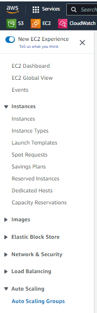  
2. Select **Create Auto Scaling Group**    
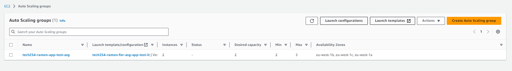
3. Type in the name of the auto scaling group
4. Select the Launch template that you created  
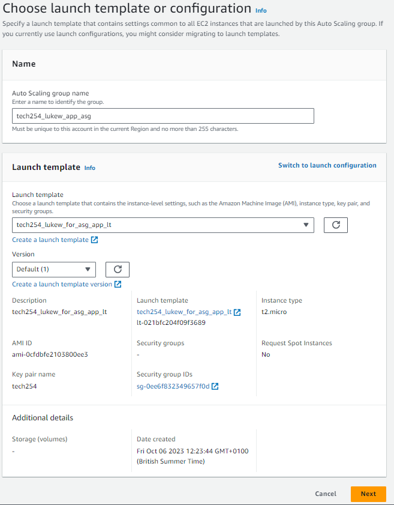
5. In Network, for availability zones and subnets, select default 1a, 1b, and 1c
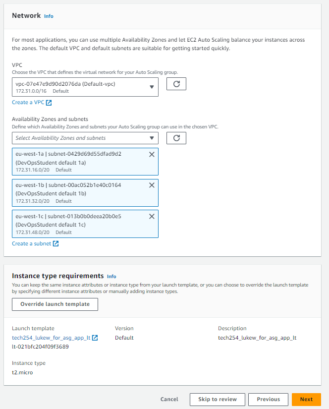
6. For load balancing, select **Attach to a new load balancer**, this is because we need to create a load balancer to associate with our auto-scaling group    
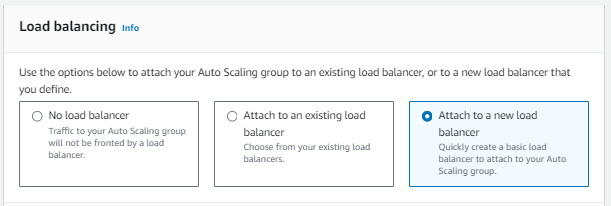
7. For the Load balancer settings, select Application Load Balancer, this is becuase our traffic will be using HTTP.
8. Write in the name for the load balancer
9. For load balancer scheme, select Internet-facing as the traffic to the load balancer will be coming from the internet.
10. Under **Listeners and routing** create a target group with a name
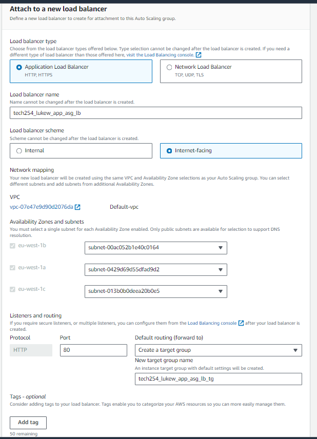
11. For health check, turn on the Elastic Load Balancing health checks
12. Click Next
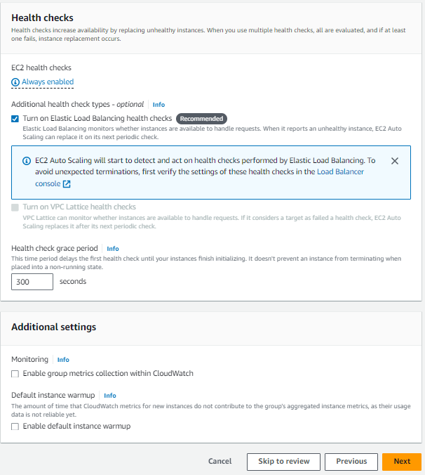
13. Group size, write out the number of instance for min, max, and desired
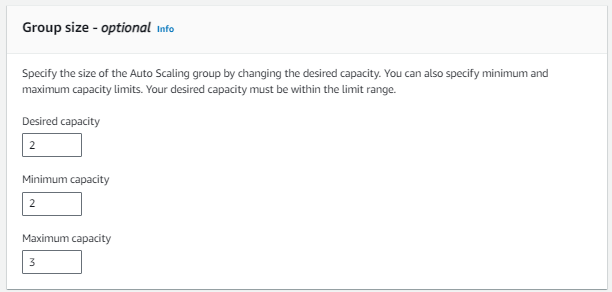
14. Scaling Policies, select target tracking scaling policy.
15. Select Next
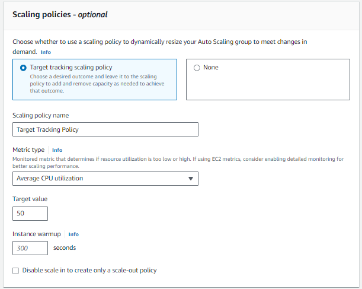
15. For the review, ensure all the details are correct
16. Select **Create Auto Scaling Group**  
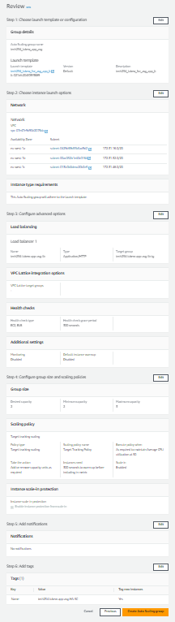

### Worst to Best preventions of CPU usage disasters

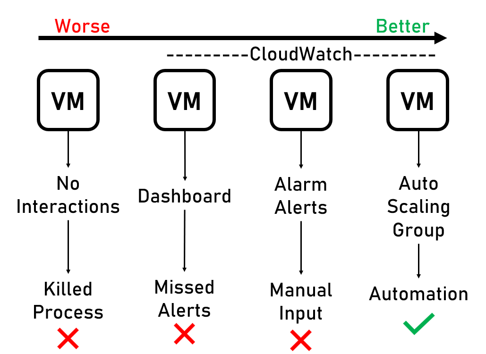
