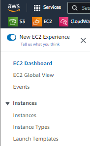
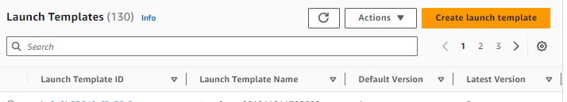
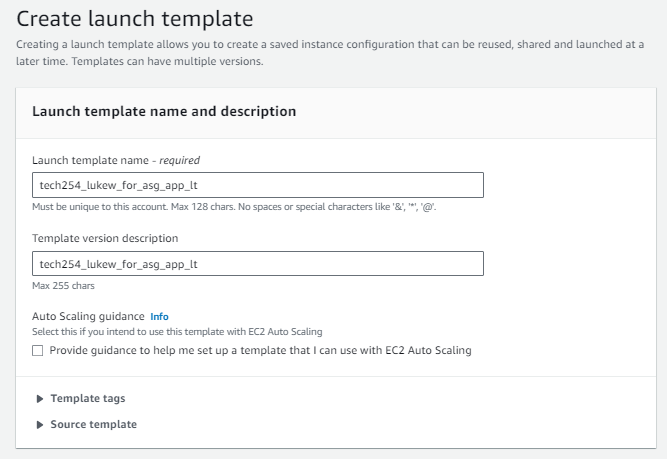
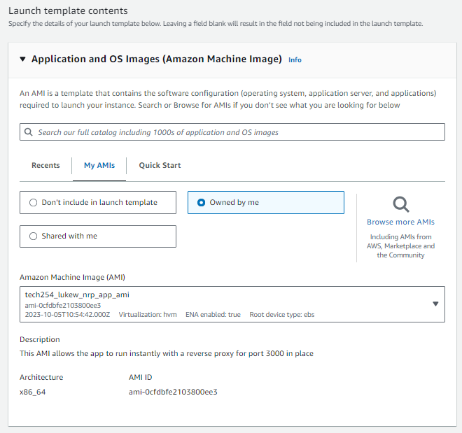
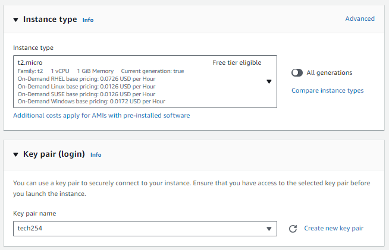
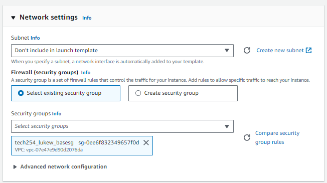
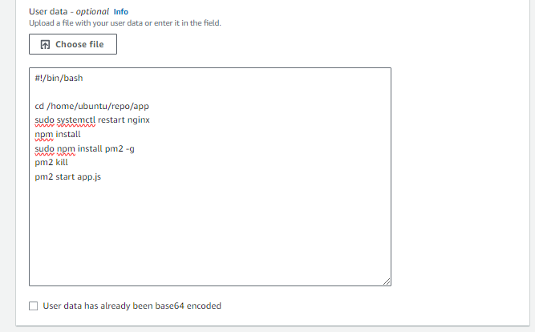
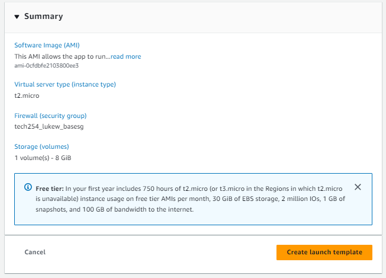

1. Start by heading to EC2 on AWS
2. On the navigation bar on the right hand side, select **Instances**, then **Launch Templates**  

3. On the Launch Templates page, select **Create launch template**, it is the orange button  

4. Within creating the template, first fill out the name and description  

5. Under contents, in AMI, select your AMI that has the app ready to run  

6. **Instance type**, select **t2.micro**, should be the one set to **Free their eligible**  
7. **Key pair**, select **tech254**  

8. **Network settings**, select that base_sg that contains SSH, HTTP, Port 3000. 

9. Under Advance settings, scroll down to the bottom where you can enter the User data.  

```
#!/bin/bash

cd /home/ubuntu/repo/app
sudo systemctl restart nginx
npm install
sudo npm install pm2 -g
pm2 kill
pm2 start app.js
```
10. In **Summary** double check that all the settings are correct.  

11. **Create launch template**
