# Creating an EC2 Instance and Deploying nginx webserver

### Starting an instance
- To Start you want to go into AWS service called EC2 and Start and instance by clicking the orange button "Launch Instance". For the setup of the instance follow the steps below, anything not mentioned directly is left as default.
  - **Name and tags**
    - **tech254_lukew_nginx**
    - The name and tags is to distinct your instance from others so having a clear and consistant naming system is important, for most cases I will use "tech254_lukew" followed by the use of the instance, in this case "nginx" as I am creating a nginx webserver. This should look like:
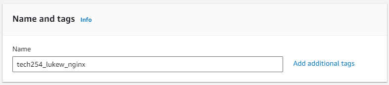
  - **Application and OS Images**
    - The Amazon Machine Image is apart od the Application and OS Images, these contain base templates for software configuation that is required for the virtual machines. To access the AMI for nginx follow the step by step process below:
    - **Browse more AMIs** - On the page, click on the link to browse more AMIs, this should be found on the right hand side with a magnifying glass
    - **Community AMIs** - Along the tabs, go to community AMIs, this is where AMIs created by the community are posted, be careful with these as they aren't always verified by AWS.
    - **18.04 LTS 1e9** - In the search bar enter "18.04 LTS 1e9" and there should be two options that appear, for this we want the Ubuntu version 18.04
    - **ami-0a7493ba2bc35c1e9** - This is the AMI id, use this to check you have the correct AMI
    - Click **select** on the Ubuntu AMI, this will take you back to the launch instance page showing:
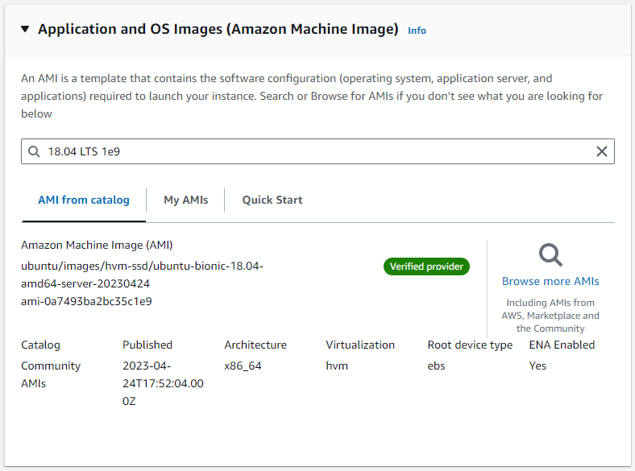
  - **Instance Type** - Instance types comprise varying combinations of CPU, memory, storage, and networking capacity and give you the flexibility to choose the appropriate mix of resources for your applications.
    - **t2.micro** - Select the t2.micro instance type as this provides Free tier eligibility.
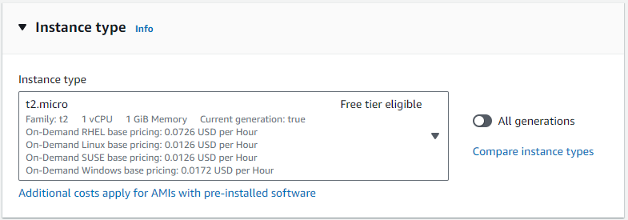
  - **Key pair** - Key pair is used to securely connect you to your instance, for this it is a ssh key which is called tech254.
    - **tech254** - This key is a .pem file. Privacy Enhanced Mail (PEM) files are concatenated certificate containers frequently used in certificate installations when multiple certificates that form a complete chain are being imported as a single file
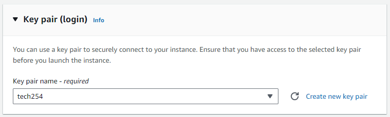
  - **Network Settings**
    - **Security group name** - Set a unique name for this, including your previous format (tech254_lukew) with the use of the security group
      - tech254_lukew_basesg
    - **Description** - for now keep the same as the name, but when the security is more complex, a more detail description might be required
    - **Inbound Security Group Rules**
      - **port range** - These are fixed for different source types
        - ssh - 22
        - HTTP - 80
        - HTTPS - 443
      - **Source type** - The source type is to select who can view your instance,
        - **Anywhere** - Anyone with the ip can view the instance
    - **Add security group rule** - Add two more security group roles, one for HTTP and one for HTTPS each with the same Source type
      - Type
        - HTTP
      - Source Type
        - Anywhere (i.p 0.0.0.0/0 (wildcard))
    - Add security group rule
      - Type
        - HTTPS
      - Source Type
        - Anywhere  
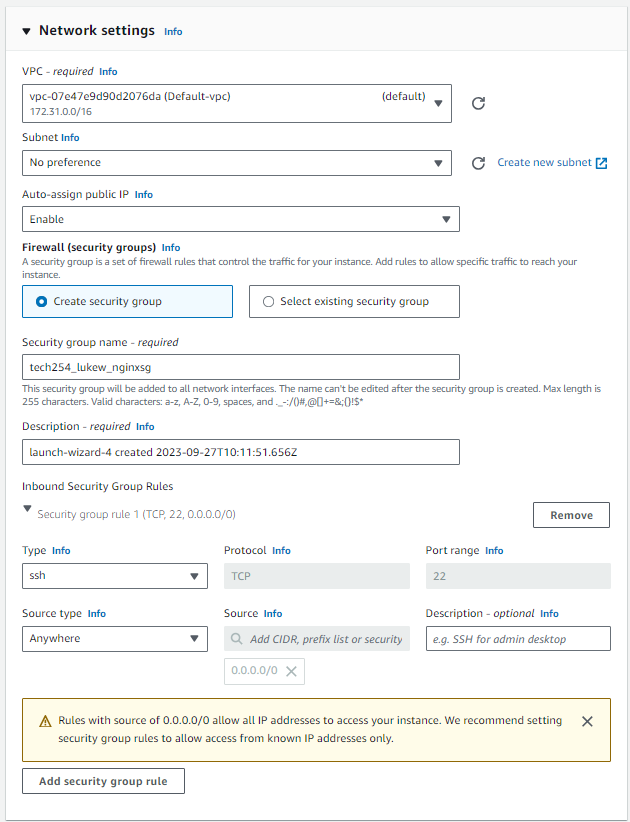
  - **Configure Storage**
    - **Default**
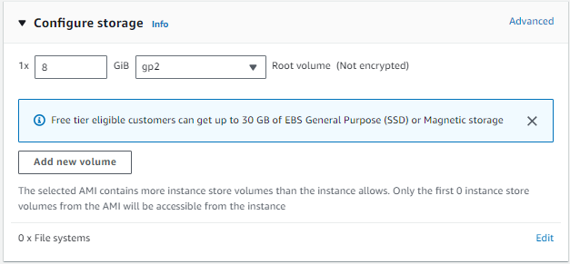
  - **Advance Details**
    - **Default**
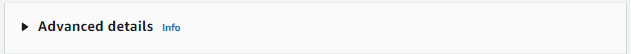
  - **Summary** - Check your summary to ensure you have all the correct details  
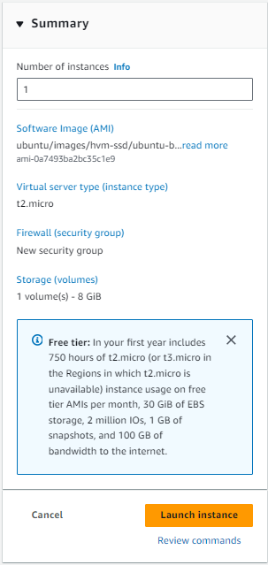
  - **Launch instance**

### Running Instance
- **Instance Summary** - Once your instance has launched you can view it's summary view clicking on the Instance ID (i-06a83a8d684ce7e37)
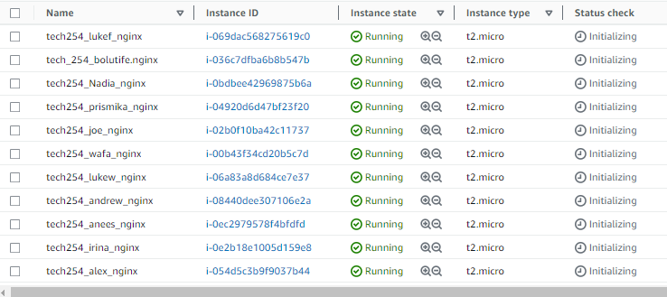
- **On AWS click connect**
- **SSH client**
- **Copy the Example, ensure that the user (ubuntu) is correct**
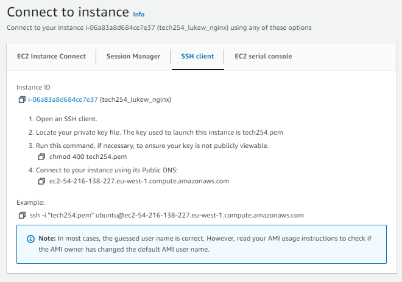
- **Run GitBash** (Run as admin)(Need to log onto each git bash you want to use instance)
  - `cd .ssh` Entering your ssh file
  - `chmod 400 tech254.pem` Makes the file read only, can't open and write in it, only need to do this once, if already done can skip
  - `ssh -i "tech254.pem" ubuntu@ec2-54-216-138-227.eu-west-1.compute.amazonaws.com` (new ip each time you run after stopping)
    - ssh (use ssh)
    - -i (identity)
    - "tech254.pem" (ssh key pair)
    - ubuntu@ec2-54-216-138-227.eu-west-1.compute.amazonaws.com (where we want to go, ubuntu refers to the user your logging in as)
    - output: 
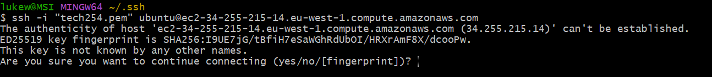
    - Type yes to confirm
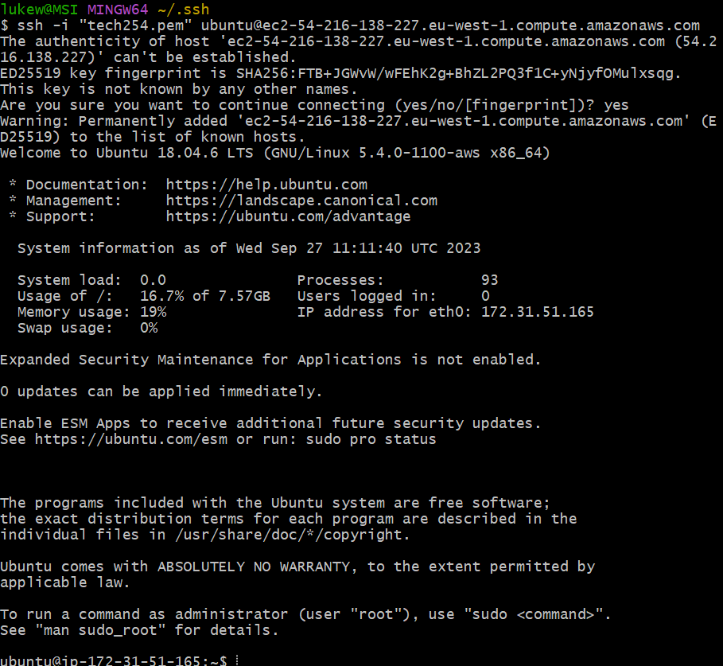

### Update virtual desktop
- `sudo apt update` (finds all available updates but doesn't implement them)(confirms internet connection)
- `sudo apt upgrade -y` (Take all the latest updates and implements the ones that need an update)
  - -y (confirmation (yes))

### Installing and Starting ngix
- `sudo apt install nginx -y` - Installs nginx
- `sudo systemctl start nginx` - Starts the nginx  
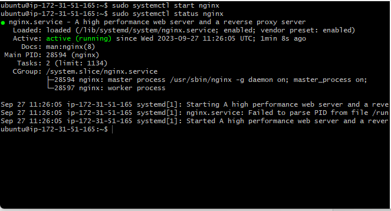 
- go back to AWS and find your ip address in your instance summary  
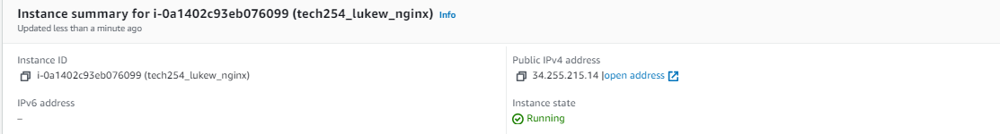
- paste that into new url
  - Output:  
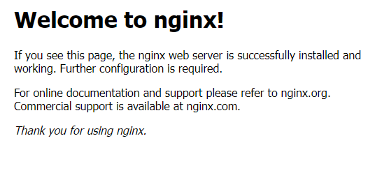

# Nginx
Nginx, pronounced as "engine-x," is a powerful web server and reverse proxy server software. It serves as a bridge between users' web browsers and web applications, handling incoming requests and delivering web content efficiently.

- **Web Server:** Nginx serves web content like HTML files and images to users when they visit a website. It handles multiple simultaneous requests, ensuring fast and reliable delivery.

- **Reverse Proxy:** Nginx acts as an intermediary between users and web servers, distributing incoming requests to the appropriate backend servers. This improves load balancing and enhances security by hiding server details.

- **High Performance:** Nginx is renowned for its efficiency and low resource usage. It can handle a large number of concurrent connections, making it a popular choice for serving websites with high traffic loads.

# Webserver
A web server is a specialized computer program or hardware device that plays a crucial role in how the internet functions. It's like the traffic cop of the internet, managing the flow of data between your computer and the websites you visit. Here are some key technical aspects:
- **Request Handling:** Web servers receive requests from your web browser when you enter a website's URL. They process these requests and deliver the requested web pages or files to your browser.
- **Hosting Websites:** Web servers store and serve website content, including text, images, videos, and more. Websites are essentially a collection of files hosted on a web server.
- **IP Address and Port:** Web servers have unique IP addresses and use specific ports to communicate on the internet. When you type a URL (e.g., www.example.com) into your browser, it contacts the web server's IP address to fetch the website.

