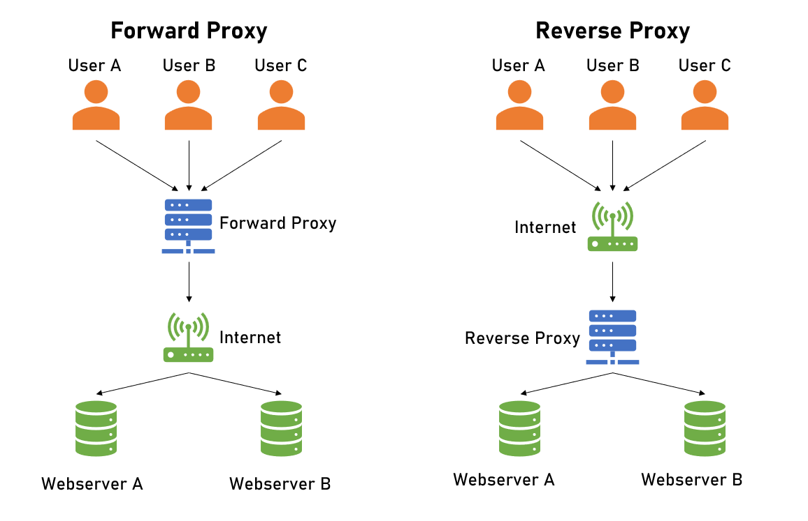
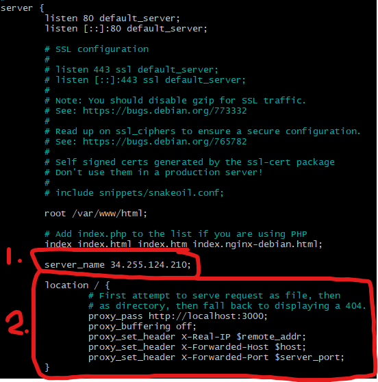

### What are ports?

- A port in networking is a software-defined number associated to a network protocol that receives or transmits communication for a specific service

### What is a reverse proxy? 

- In computer networks, a reverse proxy is an application that sits in front of back-end applications and forwards client requests to those applications. Reverse proxies help increase scalability, performance, resilience and security.

#### How is it different to a proxy? (research)

- A reverse proxy is a server that sits in front of one or more web servers, intercepting requests from clients. This is different from a forward proxy, where the proxy sits in front of the clients.

### Diagram showing the difference between forward and reverse proxy.



### What is Nginx's default configuration (hint - 'sites-available' directory)

- /etc/nginx/nginx.conf

## How to set up reverse proxy:
- For this you run an instance for your app, use the AMI created for the app.
- Log into your instance on Git bash
```
sudo nano /etc/nginx/sites-available/default
```
- This command allows you to access information on connecting to nginx.
- Inside the file, you need to change/ add two things
  - First replace the _ after server_name with the public IP address of the app
  - Secondly set up the proxy with the following:
    - ```
      proxy_pass http://localhost:3000;
      proxy_buffering off;
      proxy_set_header X-Real-IP $remote_addr;
      proxy_set_header X-Forwarded-Host $host;
      proxy_set_header X-Forwarded-Port $server_port;
      ```

  
- Save and Exit
```
sudo systemctl restart nginx
```
- Restart nginx so that the proxy is set up properly. (If not done, frontend errors can occur)
- Run the app through the app file.
- Test out on webpage by only entering the public IP of app without port 3000.
