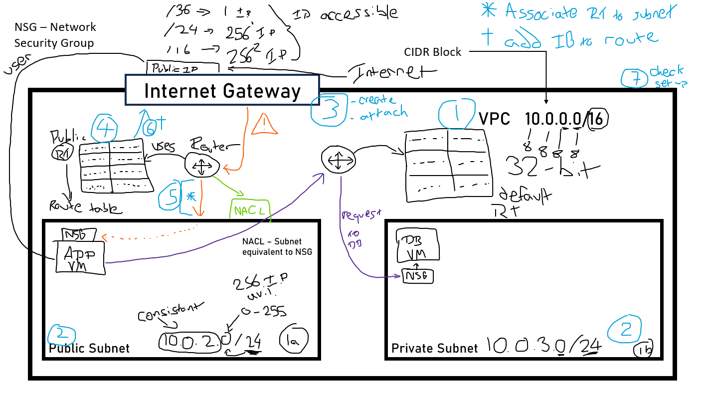

# VPC - Virtual Private Cloud
## Diagram reference of VPC:

### What is VPC?
- VPC is a virtual private cloud that acts similarly to a VPN (Virtual Private Network) that you can operate in your own datacenter, this provides security and protection as your data is stored away from public use. With a VCP, you can add in Subnets
- A virtual private cloud (VPC) is a secure, isolated private cloud hosted within a public cloud. VPC customers can run code, store data, host websites, and do anything else they could do in an ordinary private cloud, but the private cloud is hosted remotely by a public cloud provider. (Not all private clouds are hosted in this fashion.) VPCs combine the scalability and convenience of public cloud computing with the data isolation of private cloud computing.

### What are subnets?
- Subnets are a range of IP addresses within your VPC, tht resides within a single availability zone. You can set your subnet to private or public depending on if you want the subnet accessed through the internet or internally.

### How does IP addressing work?

- When it comes to IP addresses you can assign ranges to your VPC and subnets, the format follows 0.0.0.0/0

ansible.builtin.shell: |
        export DB_HOST=mongodb://53.212.166.97:27017/posts
      environment:
        DB_HOST: mongodb://53.212.166.97:27017/posts