# How to create a VPC
This is a step by step guide on how to create a VPC (Virtual Private Cloud) on AWS. As well as running both an app and database instance on the VPC.

## Diagram setting up the VPC
Below is a diagram showing how a VPC functions, as a part of this, a step-by-step process on setting up a VPC can be established in number format in light blue:

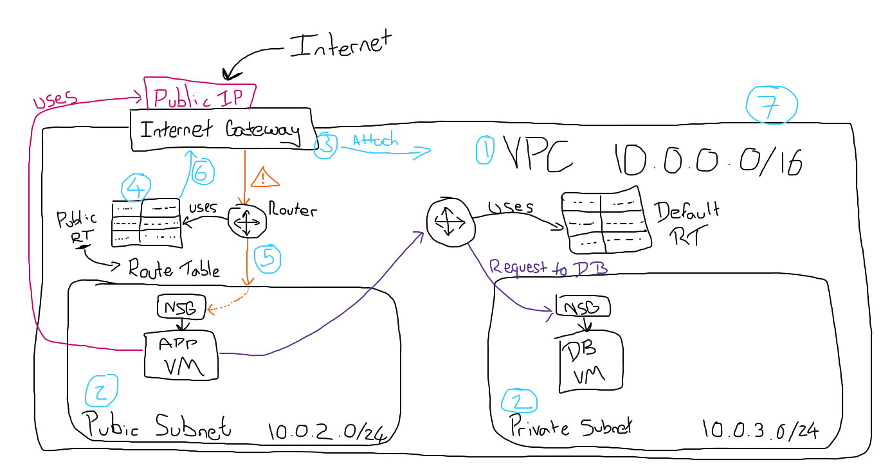  
1. Create the VPC
2. Create the Subnets
3. Internet Gateway
   1. Create
   2. Attach to VPC
4. Create Public Route Table
5. Connect the Router to Public Subnet
6. Connect the Router and Internet Gateway
7. Check all Connects in Resource Map

### 1. Creating a VPC 
- **VPC Service** - For the first step, you would want to access the VPC service on the AWS website. Go to the search bar at the top and search in "VPC", in the dropdown you will find VPC located under services marked with a purple icon.
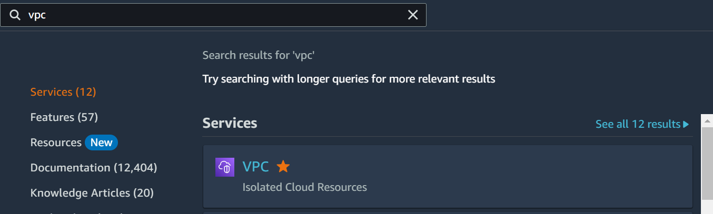
- **Your VPCs** - On you are in the VPC service, you will want to navigate over to the VPC dashboard on the left hand side, under "Virtual private cloud", select the option "Your VPCs". This will take you to where all the VPCs on this account are stored.
- **Create VPC** - Once you are on Your VPCs, you will want to create your own, on the screen will be an orange button with "Create VPC", please select this.
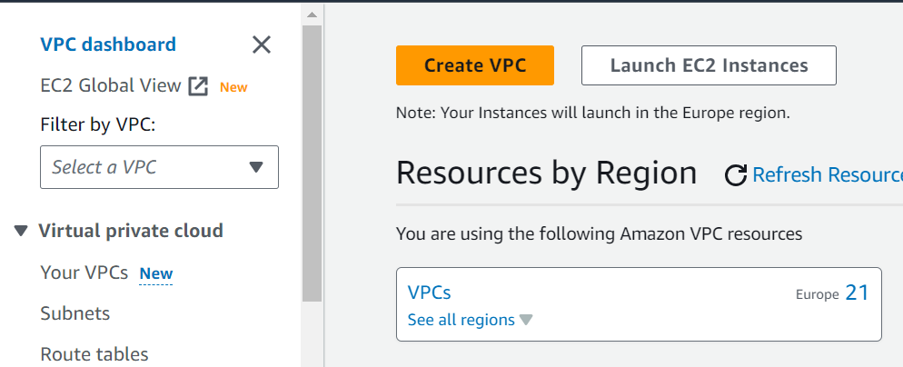
- **VPC only** - Once you are in the create VPC page, you will want to select "VPC only", we are only looking to create a basic VPC.
- **Name tag** - For the name tag, follow the proper naming convention, example: tech254-lukew-2tier-first-vpc
  - (**2tier** - this refers to the fact that we are creating a two tier architecture structure for the VPC)
- **IPv4 CIDR** - set this to 10.0.0.0/16
- **No IPv6 CIDR block** - Leave this as default as we won't need to use it.
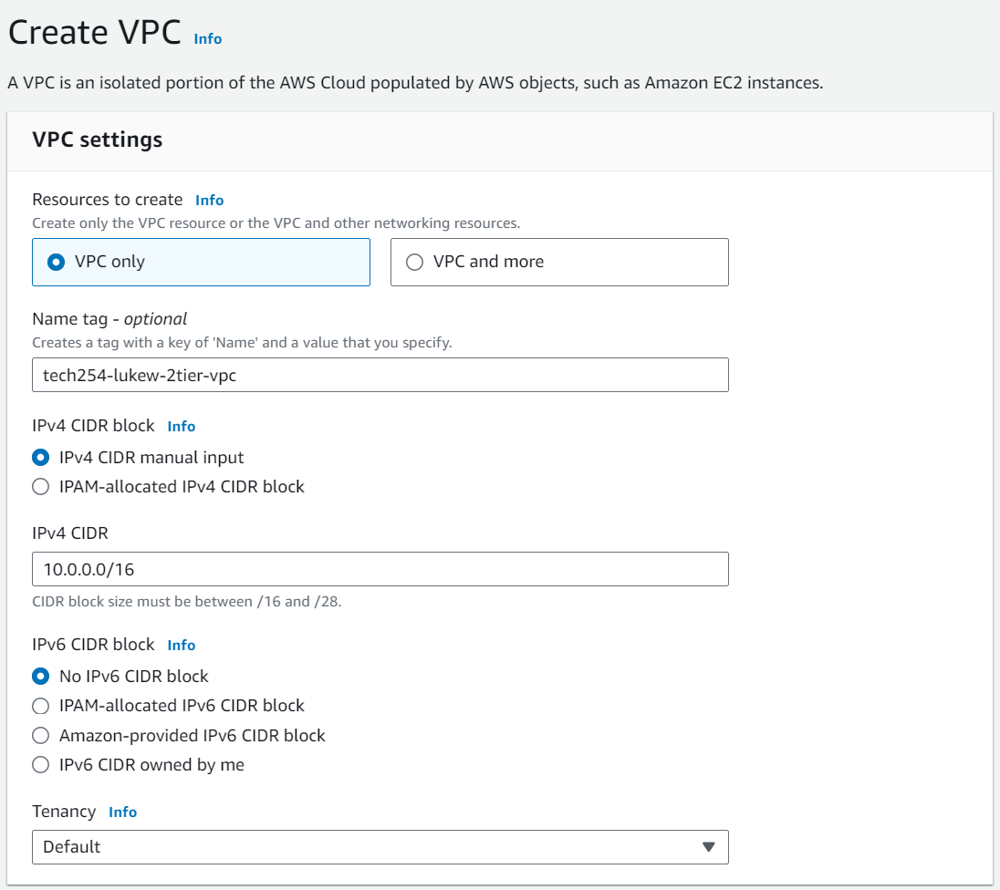
- **Create VPC** - Once all of these settings have been set, select the orange button in the bottom right "Create VPC"

### 2. Creating Subnets
- **Subnet** - Now back in the Your VPC page, nagviagte to the VPC dashboard, under "Virtual private cloud", select "Subnet"
- **Create Subnet** - Inside the subnet page, select the orange button "Create Subnet"
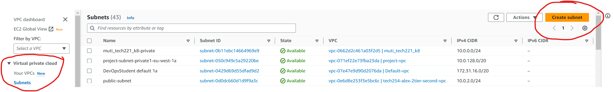
- **Select Your VPC** - In the first slot, select the VPC you created, this should be easy to find based on the naming convention.
- **Subnet name** - For the first subnet, we want to call this "public-subnet" as this will be our public subnet. No naming convention is required here as it is directly linked to the VPC.
- **Availability Zone** - For this we want to set a specific availability zone, just because otherwise AWS will randomly select one, we don't want AWS placing both subnets into the same zone, for the public subnet choose "eu-west-1a".
- **IPv4 subnet CIDR block** - Type in "10.0.2.0/24"
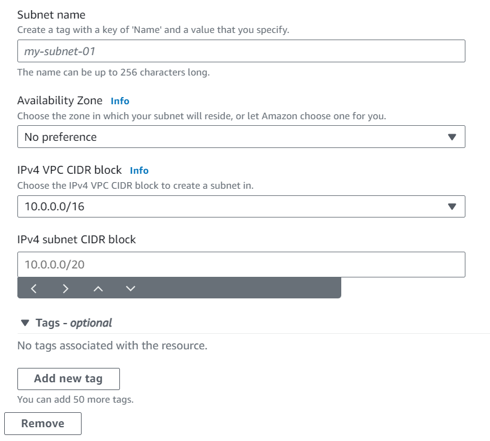
- **Add new subnet** - Check that all the settings are correct, if so we need to create our second subnet, instead of doing them separately we can create both here by selecting "Add new subnet" on the bottom left. 
- **Subnet name** - Same as before but this one call "private-subnet"
- **Availability Zone** - Same again but select "eu-west-1b"
- **IPv4 subnet CIDR block** - Type in "10.0.3.0/24"

- **Create subnet** - Check all your information is correct, then select the orange button in the bottom right "Create Subnet"

### 3. Create Internet gateway
- **Internet Gateway** - Now back on the subnet page, navigate to the VPC dashboard on the left, under "Virtual private cloud", select "Internet Gateway"
- **Create internet gateway** - In the page, select the orange button, "Create internet gateway"
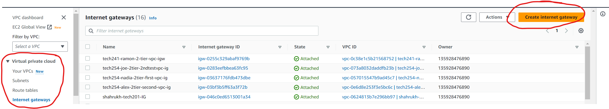
- **name tag** - Fro the name tag, follow the same naming convention but ensure it defines it's an internet gateway, example: tech254-lukew-2tier-first-vpc-ig
- **Create internet gateway** - In the bottom right select the orange button, "Internet Gateway"
- **Actions** - Next step is the attachment the internet gateway to our VPC, for this in the top right select "Actions" 
- **Attach to VPC** - From the dropdown, select "Attach to VPC"
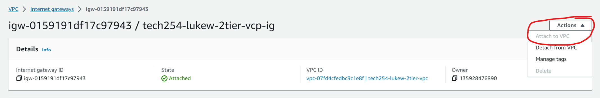
- **Your VPC** - In the VPC, search up and select the VPC you have created
- **Attach internet gateway** - Once your VPC is selected, select the orange button "Attach internet gateway"

### 4. Create public route table
- **Route tables** - On the Internet gateway page, navigate to the VPC dashboard and under "Virtual private cloud", select "Route tables"
- **Create route table** - On the route table page, select the orange button "Create route table", this allows you to create your own route table.
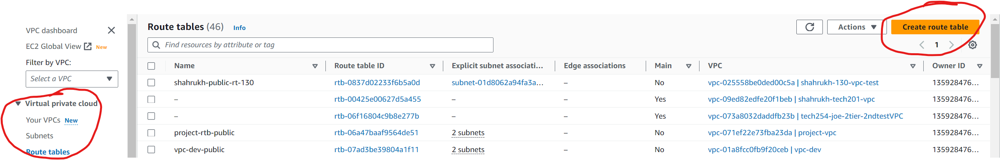
- **Name** - Type in "public-rt" referring to public route table. You don't need the naming convention here.
- **Your VPC** - Select the VPC you want to connect the route table to, in this case it will be the VPC you created.
- **Create route table** - Check your details then select the orange button "Create route table"

### 5. Associate the route table to Subnet
- **Subnet Associations** - In the route table, on the navigator bar under your route table, select the tab "Subnet Associations"
- **Edit Subnet Associations** - In "Explicit subnet associations" on the right side, select "Edit subnet associations"
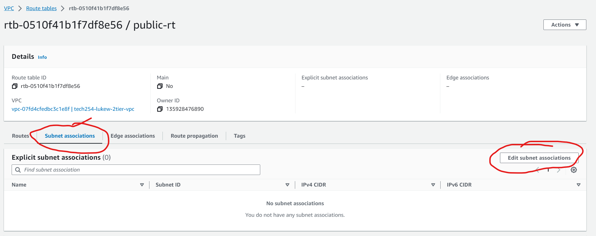
- **public-subnet** - Select your public subnet 
- **Save associations** - Once selected, select the orange button "Save associations"

### 6. Add Internet Gateway to route
- **Route** - In the route table, in the navigation bar, select "Route"
- **Edit route** - On the right side, select "Edit route"
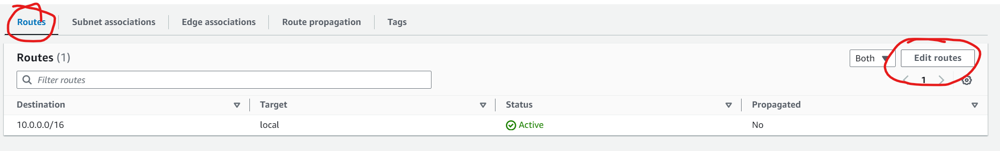
- **Add route** - 
- Destination - 0.0.0.0/0
- Target - Internet Gateway - Your VPC
- Save changes

### 7. Checking connections
- In navigation bar go to Your VPCs
- Select VPC ID on Your VPC
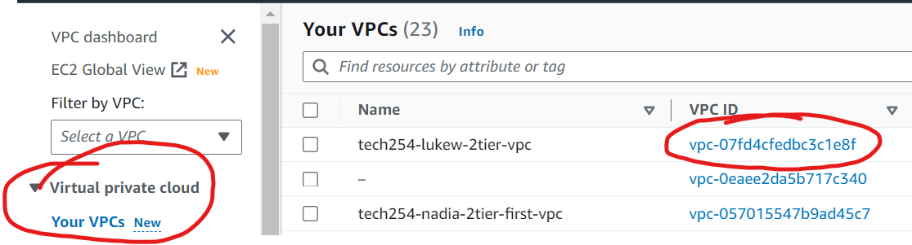
- Go to Resource map to check the connections
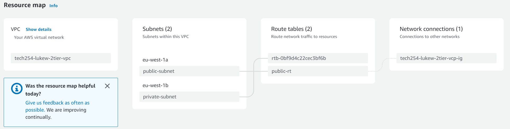

## Set-up for instance on VPC.


### Setting up the DB virtual machine
- Go to EC2
- on navigation bar go to Images, AMIs  
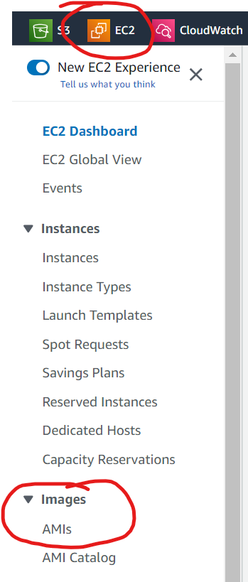
- Search for db image
- Select images
- Launch instance from AMI
- Name - tech254-lukew-db-test-first-vpc
- Key pair - tech254
- Network settings
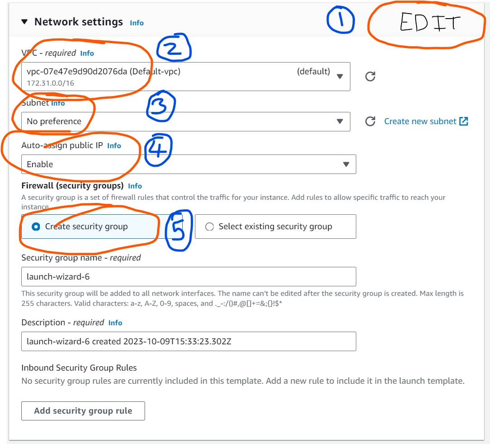
  1. Edit
  2. VPC - select VPC
  3. subnet - private-subnet
  4. Auto-assign public IP - Disable
  5. security group -  **Create security group**
     - (associated with particular vpc)
     - create new security group
     - name - tech254-lukew-db-test-first-vpc-sg-ssh-mongo
     - inbound - ssh, mongo (27017)
- Launch instance

### Setting up app virtual machine
- Go to EC2
- on navigation bar go to Images, AMIs
- Search for app image
- Select images
- Launch instance from AMI
- Name - tech254-lukew-app-test-first-vpc
- Key pair - tech254
- Network settings

  1. Edit
  2. VPC - select VPC
  3. subnet - public-subnet
  4. Auto-assign public IP - Enable
  5. security group
    - associated with particular vpc
    - create new security group
    - name - tech254-lukew-app-test-first-vpc-sg-ssh-http-3000
    - inbound - ssh, http, nodejs app (3000)
- Advance details
  - User data
```
#!/bin/bash

# IP address of the db, this will be a private IP
export DB_HOST=mongodb://34.247.106.99:27017/posts

cd /home/ubuntu/repo/app
sudo systemctl restart nginx
npm install

node seeds/seed.js

sudo npm install pm2 -g
pm2 kill
pm2 start app.js
```
- Launch instance

### Deleting everything
- Instances
  - Select instances
  - actions
  - terminate instances
- Unwanted AMI
  - Go to AMIs
  - Select AMI to delete
  - actions 
  - deregister
  - save snapshot
  - go to snapshots
  - delete snapshots
- Security group
  - navigation bar, network and security, security groups
  - select security group
  - actions
  - delete
  - type delete
  - delete
- Delete VPC
  - Go to VPC
  - navigation bar, VPC, Your VPC
  - select VPC
  - actions
  - Select VPC
  - type delete
  - Delete
