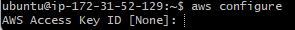
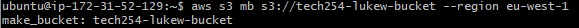
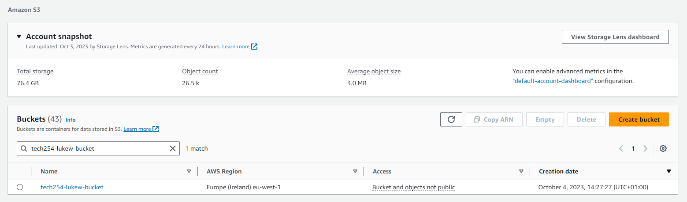
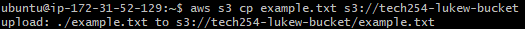
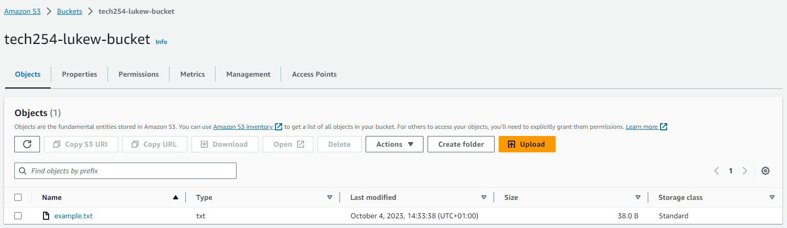
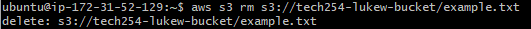
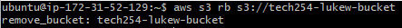

# Setting up AWSCLI
- Launch instance
  - tech254_lukew_s3
  - 18.04 LTS 1e9
  - tech254
  - tech254_lukew_basesg (only need 22, but avoid creating new sg)
  - Launch
- Connect to instance on Git Bash
- Run the following code in CLI:
```
sudo apt update
sudo apt upgrade -y
sudo apt install python -y
sudo apt install python-pip -y
sudo pip install awscli
aws configure
```
- Enter the following credentials in configure  

  - AWS Access Key ID [None]:
  - AWS Secret Access Key [None]:
  - Default region name [None]:
  - Default output format [None]:  

```
aws s3 ls
```
This command shows all the buckets available

## CLI for bucket interactions
#### Creating a bucket
```
aws s3 mb s3://tech254-lukew-bucket --region eu-west-1
```
- mb - make bucket
- default region is specified in config.  

- On AWS s3 you can view your created bucket  

#### Upload to bucket
```
sudo nano example.txt
aws s3 cp example.txt s3://tech254-lukew-bucket
```
- Upload to bucket    

- In AWS s3 you can find inside the bucket your file  

#### Download from Bucket
```
aws s3 sync s3://tech254-lukew-bucket s3_downloads
```
- Download from bucket
#### Delete from bucket
```
aws s3 rm s3://tech254-lukew-bucket/example.txt
```
- delete from bucket  

#### Remove Bucket
```
aws s3 rb s3://tech254-lukew-bucket
```
- remove bucket  

#### Weblink to view s3 commands
- https://docs.aws.amazon.com/cli/latest/reference/s3/


# Bucket Scripts from python

### Making a bucket on AWS
```python
import boto3 # Import the boto3 library
import sys # Import sys

s3_client = boto3.client('s3') # Setting the client as the s3 on AWS
location = {'LocationConstraint': 'eu-west-1'} # Setting a variable for the region location of the bucket
s3_client.create_bucket(Bucket=sys.argv[1], CreateBucketConfiguration=location) # Create the bucket on AWS
```

### Upload a file to a bucket on AWS
```python
import boto3
import sys
import os


file_name = sys.argv[1] # First argument is the file name
bucket = sys.argv[2] # Second argument is the bucket location
object_name = os.path.basename(file_name) # setting the output object_name to file name

s3_client = boto3.client('s3') # Connecting client as s3
s3_client.upload_file(file_name, bucket, object_name) # Upload file to AWS
```

### Download a file from a bucket on AWS
```python
import boto3
import sys


s3_client = boto3.client('s3')
s3_client.download_file(sys.argv[1], sys.argv[2], sys.argv[3]) # argv[1] - bucket_name, argv[2] - object_name, argv[3] - file_name 
```

### Delete a bucket on AWS
```python
import boto3
import sys


s3_client = boto3.client('s3')


def delete_all_objects(bucket_name):
    res = s3_client.list_objects_v2(Bucket=bucket_name) # Collecting all the files inside the bucket
    if 'Contents' in res:
        objects = [{'Key': obj['Key']} for obj in res['Contents']] # Placing the objects into a key format that will suit the delete_objects command
        s3_client.delete_objects(Bucket=bucket_name, Delete={'Objects': objects}) # deletes all the files within the bucket

delete_all_objects(sys.argv[1]) # naming the bucket to delete
s3_client.delete_bucket(Bucket=sys.argv[1]) # deleting the bucket itself
```

### List all buckets available
```python
import boto3

s3_client = boto3.client('s3')
response = s3_client.list_buckets() # Collects a list of available buckets


print('Existing buckets:   ')
for bucket in response['Buckets']:
    print(bucket['Name']) # prints out each of the buckets on a separate line.
```

### Delete a specific file from a bucket
```python
import boto3
import sys


s3_client = boto3.client('s3')
s3_client.delete_object(Bucket=sys.argv[1], Key=sys.argv[2])  # Deletes the file from bucket(argv[1]) and specific file(argv[2])
```
